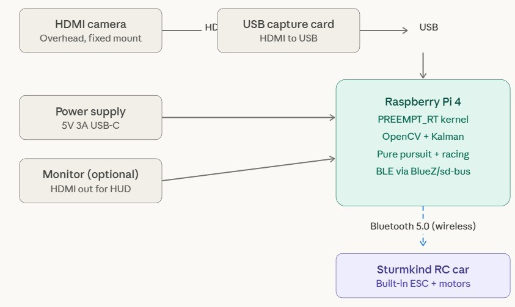
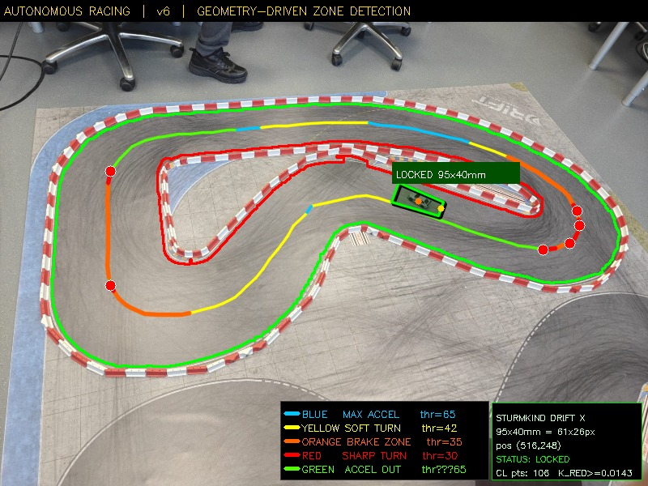
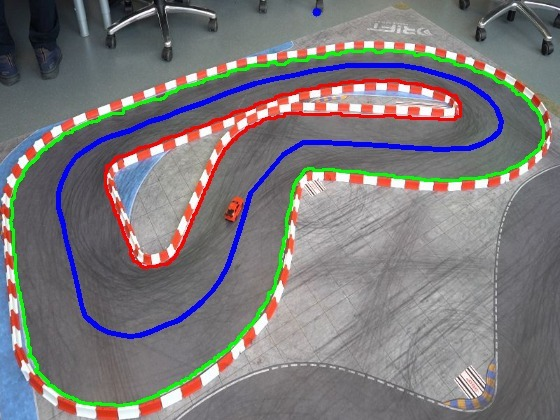
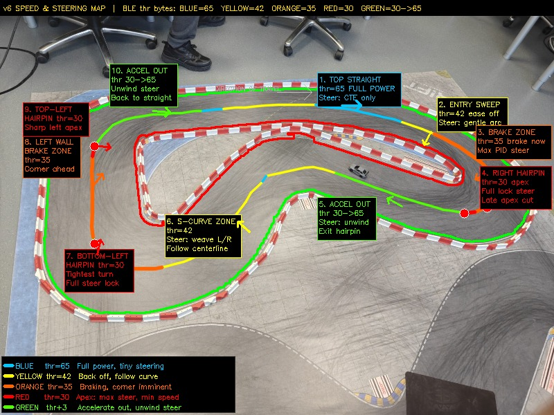

# 🏎️ Autonomous Racing System

A modular autonomous racing project designed for real-time track detection, path planning, and vehicle control. This system integrates perception, control, and safety components to enable intelligent navigation on a racing track.

---

## 🚀 Features

* **Track Detection & Tracking** – Detects and follows track centerlines
* **Pure Pursuit Controller** – Smooth path-following algorithm
* **Safety Monitoring** – Ensures safe operation during runtime
* **BLE Communication** – Enables wireless control/monitoring
* **Modular Architecture** – Clean separation of system components

---

## 🧠 System Architecture

The project is structured into the following modules:

* `tracking_module.hpp` → Track detection and tracking logic
* `centerline_module.hpp` → Centerline estimation
* `pure_pursuit_controller.hpp` → Steering and control algorithm
* `safety_monitor.hpp` → Safety checks and fail-safes
* `ble_manager.hpp` → Bluetooth communication
* `main.cpp` → Entry point of the application

---

## 📸 Project Visualization

| Block Diagram                  | Car Detection                  |
| ------------------------------ | ------------------------------ |
|  |  |

| Centerline Detection        | Zones                  |
| --------------------------- | ---------------------- |
|  |  |

---

## ⚙️ Requirements

* C++17 or later
* CMake (3.10+)
* OpenCV (if used for vision processing)
* Compatible compiler (GCC / Clang / MSVC)

---

## 🛠️ Build Instructions

```bash
# Clone the repository
git clone https://github.com/swayamjakhalekar-commits/IoT_Project_Group-F.git
cd IoT_Project_Group-F

# Create build directory
mkdir build
cd build

# Build project
cmake ..
make
```

---

## ▶️ Running the Project

```bash
./autonomous_racing
```

*(Executable name may vary depending on your build configuration)*

---

## 📁 Project Structure

```
IoT_Project_Group-F/
│
├── src/
│   └── main.cpp
│
├── include/
│   ├── ble_manager.hpp
│   ├── centerline_module.hpp
│   ├── pure_pursuit_controller.hpp
│   ├── safety_monitor.hpp
│   └── tracking_module.hpp
│
├── images/
│   ├── block_diagram.jpeg
│   ├── car_detection.jpeg
│   ├── centerline.jpeg
│   └── zones.jpeg
│
├── CMakeLists.txt
├── CHANGES.md
└── README.md
```

---

## 🧪 Future Improvements

* Add simulation environment (Gazebo / CARLA)
* Integrate advanced path planning (MPC)
* Improve perception using deep learning
* Add telemetry dashboard

---

## 👨‍💻 Author

**Swayam Jakhalekar, Shantanu Shende**

---

## 📄 License

This project is for academic and educational purposes.

---
